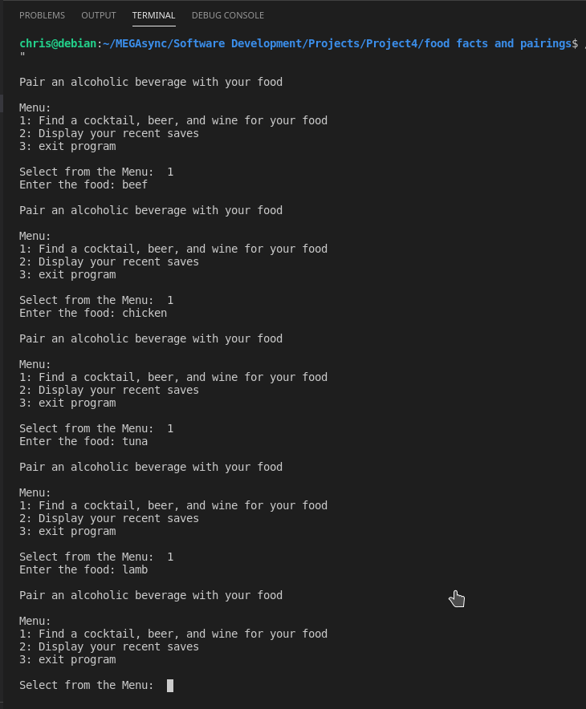

<h1>Food Alcohol Pairing</h1>

This program will pair 3 alcoholic drinks for a specific food the user enters

make sure you have git installed in your computer

clone the directory:
In the terminal or cmd type:
git clone https://github.com/cgisala/Project4_Spring2021

<h2>Pictures</h2>

